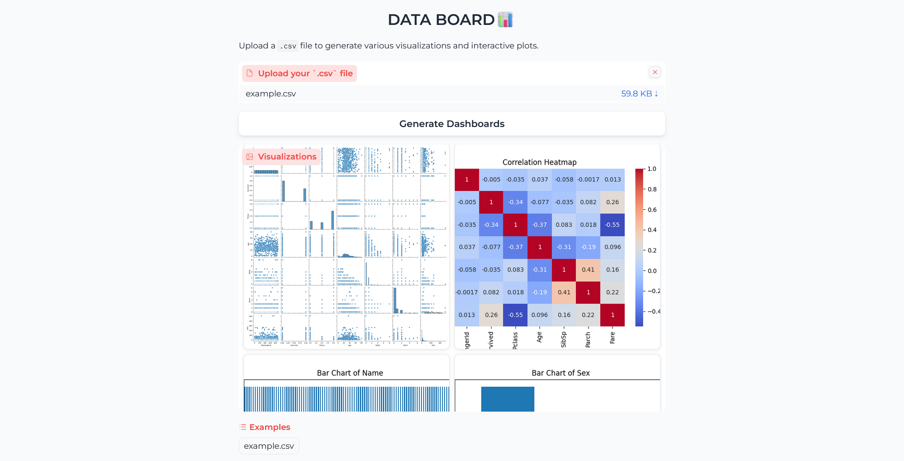
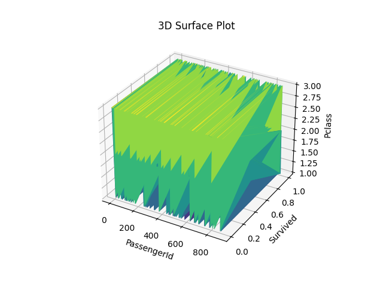
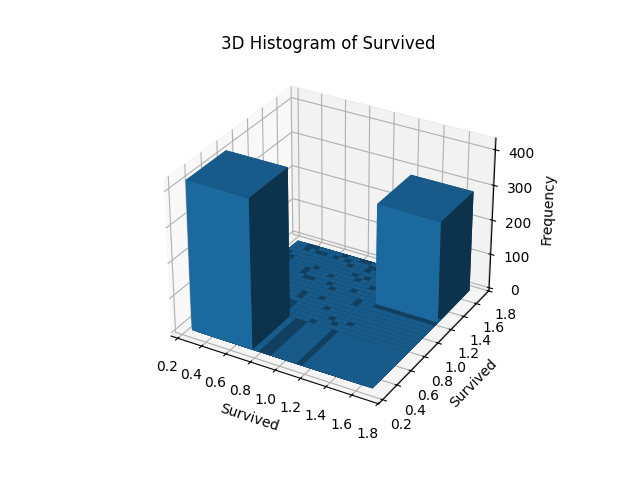
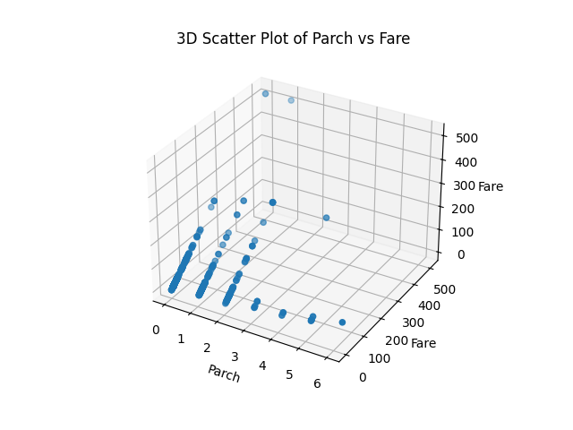
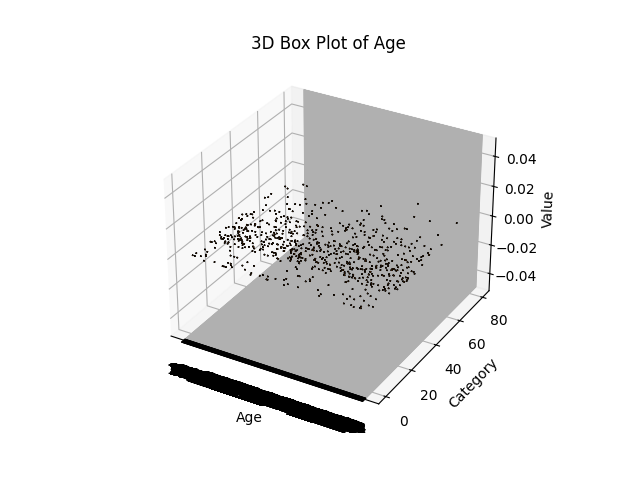

Check out the configuration reference at https://huggingface.co/docs/hub/spaces-config-reference

GITHUB

    # Make sure you have git-lfs installed (https://git-lfs.com)
    git lfs install
    
    git clone https://huggingface.co/spaces/prithivMLmods/DATA-BOARD
    
    # If you want to clone without large files - just their pointers
    
    GIT_LFS_SKIP_SMUDGE=1 git clone https://huggingface.co/spaces/prithivMLmods/DATA-BOARD

SSH

    # Make sure you have git-lfs installed (https://git-lfs.com)
    git lfs install
    
    git clone git@hf.co:spaces/prithivMLmods/DATA-BOARD
    
    # If you want to clone without large files - just their pointers
    
    GIT_LFS_SKIP_SMUDGE=1 git clone git@hf.co:spaces/prithivMLmods/DATA-BOARD

Upload CSV & Press Generate Dashboard & Wait for a While 🌝

.

.

.

Demo How it work
------------------------------------------------------------------------------------

---------------------------------------------------------------------------------------

# 3D Visualization

|  |  |
|-------------------------|-------------------------|
|  |  |

Requirements.txt

----------------------------------------------------------------------------------------------------------------------------------

| Library      | Description                                         |
|--------------|-----------------------------------------------------|
| `Gradio`     | A Python library for creating user interfaces for machine learning models. |
| `Pandas`     | A library for data manipulation and analysis, providing data structures like DataFrames. |
| `Matplotlib` | A plotting library for creating static, animated, and interactive visualizations in Python. |
| `Seaborn`    | A statistical data visualization library based on Matplotlib, offering more aesthetic and informative charts. |
| `Plotly`     | An interactive graphing library that enables the creation of interactive plots and dashboards. |
| `Scikit-learn` | A machine learning library that provides simple and efficient tools for data analysis and modeling. |

----------------------------------------------------------------------------------------------------------------------------------------
